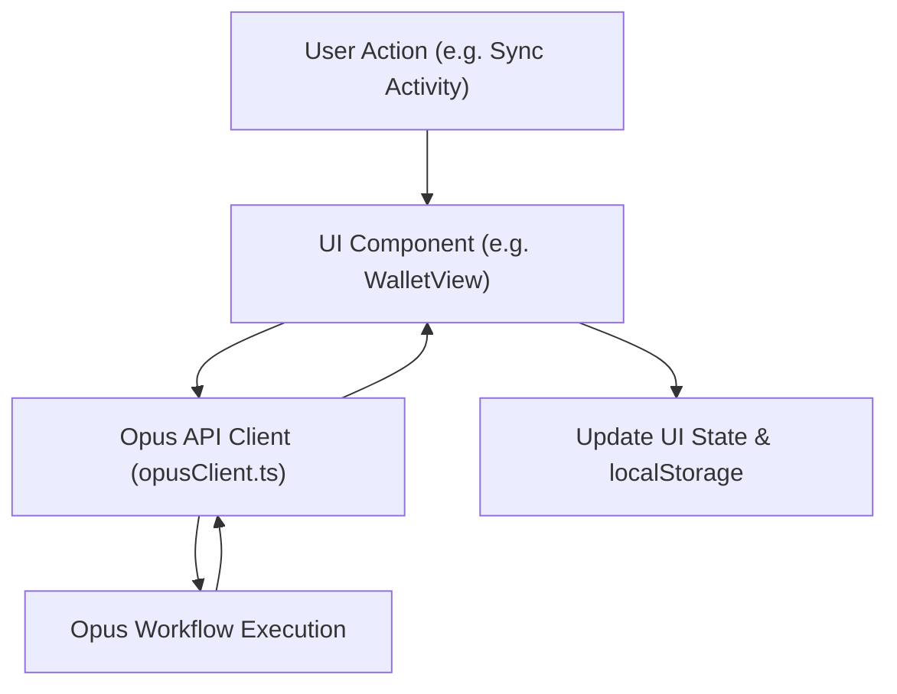

# Fitcoin Wallet 🏋️‍♂️💰


<div align="center">

[](https://reactjs.org/)
[](https://www.typescriptlang.org/)
[](https://tailwindcss.com/)
[](https://ai.google.dev/)

</div>

**Fitcoin** is a modern web application that gamifies health and wellness by rewarding users with "Fitcoins" for their physical activities. This project demonstrates a complete, professional, and responsive user experience, from a celebratory onboarding flow to a feature-rich wallet dashboard, now including a conversational AI assistant to guide users on their fitness journey.

---

## ✨ Key Features

-   🔐 **Secure User Authentication:** A complete, multi-step signup and login flow with persistent sessions.
-   📊 **Interactive Wallet Dashboard:** A central hub to view your Fitcoin balance, today's earnings, and a 7-day performance chart.
-   🔄 **Dynamic Activity Sync:** Simulate syncing data from various health providers (Strava, Apple Health, etc.) with a realistic 1-hour cooldown mechanism.
-   💬 **Conversational AI Assistant:** Chat with a Gemini-powered AI via voice or text. Get real-time answers about the app, receive fitness tips, and stay motivated with a helpful, knowledgeable companion.
-   💰 **Metric-Based Fitcoin Calculation:** A sophisticated system calculates rewards based on detailed metrics for various activities like running, cycling, and sleeping.
-   📈 **Staking & Savings Tiers:** "Staking Programs" that allow users to lock up their Fitcoins to earn an annual yield, with benefits unlocking at different tiers.
-   🛒 **Provider Rewards Marketplace:** Redeem Fitcoins for exclusive real-world rewards like gym passes, healthy snacks, and wellness app trials.
-   🤝 **Engaging Community Hub:** Compete on a weekly leaderboard, join community challenges, and view a live activity feed from other users.
-   📱 **Fully Responsive Design:** A beautiful and functional UI that seamlessly adapts to mobile, tablet, and desktop screens.
-   🎉 **Celebratory UI/UX:** Delightful animations, including confetti bursts for achievements, animated balance updates, and a smooth, welcoming onboarding experience.

---

## 🚀 Live Demo in Action

Here's a glimpse of the Fitcoin user experience, from signing up to syncing an activity, and now, conversing with your personal AI health coach.

---

## 🏗️ Architecture Overview

Fitcoin is a **frontend-only application** designed to run directly in the browser without a backend. It uses a robust mock API layer that persists all user and wallet data in the browser's `localStorage`, ensuring a seamless experience across sessions.

This architecture is perfect for rapid prototyping and creating impressive, self-contained demos.

Here is a diagram illustrating the data flow:



---

## 🧠 Core Concepts Explained

### Gemini-Powered AI Assistant

The "Ask" tab provides a state-of-the-art conversational experience powered by Google's Gemini models. It supports seamless dual-mode interaction:
-   **Real-Time Voice Chat:** Leveraging the **Gemini 2.5 Native Audio (Live API)**, users can have fluid, real-time voice conversations. The app handles live audio streaming, transcription, and audio playback for a natural back-and-forth dialogue.
-   **Text-Based Chat:** For situations where voice isn't ideal, users can type messages. The interface dynamically switches from a microphone to a send button, using the Gemini API's chat functionality for quick and accurate text responses.

The AI is equipped with a detailed system prompt, making it an expert on the entire Fitcoin ecosystem, ready to provide helpful hints and encouragement.

### Fitcoin Calculation Engine

The heart of the application is its mock rewards engine. Instead of simple random values, Fitcoins are calculated based on a detailed set of metrics that mimic real-world health providers. When a user syncs their data, the app generates a random set of realistic activities and calculates the Fitcoin reward for each using a predefined conversion rate.

```typescript
// A snippet from services/api.ts
const FITCOIN_METRICS = {
  "strava_metrics": {
    "run_distance": { "unit": "kilometers", "value_per_fitcoin": 2 },
    "active_calories": { "unit": "kcal", "value_per_fitcoin": 100 },
    // ...and many more
  }
};
```

### Activity Sync Cooldown ⏳

To encourage regular engagement, the "Sync Activity Data" button has a **1-hour cooldown**. The button is disabled during this period and displays a clear countdown timer, providing excellent user feedback.

---

## 🛠️ Technology Stack

-   **Framework:** [React 19](https://react.dev/)
-   **Language:** [TypeScript](https://www.typescriptlang.org/)
-   **AI/ML:** [@google/genai](https://www.npmjs.com/package/@google/genai) for Gemini API integration
-   **Styling:** [Tailwind CSS](https://tailwindcss.com/)
-   **Icons:** [Lucide React](https://lucide.dev/)
-   **Charting:** [Recharts](https://recharts.org/)
-   **State Management:** React Hooks (`useState`, `useEffect`, `useCallback`, `useRef`)
-   **Local Persistence:** Browser `localStorage` API

---

## 📂 Project Structure

The project is organized into a clean and maintainable structure.

```
/
├── src/
│   ├── components/
│   │   ├── AskView.tsx           # Conversational AI chat view
│   │   ├── CommunityView.tsx     # Community tab UI
│   │   ├── Confetti.tsx          # Reusable celebration animation
│   │   ├── LandingPage.tsx       # Initial landing page
│   │   ├── LoginPage.tsx         # User login form
│   │   ├── MainApp.tsx           # Main authenticated app layout
│   │   ├── MarketplaceView.tsx   # Rewards hub UI
│   │   ├── OnboardingPage.tsx    # New user signup flow
│   │   ├── SavingsView.tsx       # Staking and tiers UI
│   │   └── WalletView.tsx        # Main dashboard and activity sync
│   ├── services/
│   │   └── api.ts                # Mock API and data logic
│   ├── data/
│   │   └── (Mock provider data files)
│   ├── App.tsx                   # Root component, handles routing
│   ├── index.tsx                 # Application entry point
│   └── types.ts                  # TypeScript interfaces
├── index.html                    # HTML entry point
└── README.md                     # You are here!
```

---

## 🏁 Getting Started

This project is built for a modern browser environment like **Gemini App Builder** and requires no local installation or build step.

1.  **Environment Variable:** You must set the `API_KEY` environment variable with your Google Gemini API key for the "Ask" feature to work.
2.  **No Installation:** There are no `node_modules` to install. All dependencies are loaded directly from a CDN via the `importmap` in `index.html`.
3.  **Run:** Simply open the `index.html` file in a compatible web environment or use a simple live server.

---

## 🔮 Future Work

While this MVP is feature-complete for a demo, here are some exciting next steps:

-   **Backend Integration:** Replace the mock `api.ts` with real HTTPS calls to a production backend.
-   **Real Health Provider APIs:** Integrate directly with the APIs for Strava, Apple HealthKit, etc., to sync real user data.
-   **Push Notifications:** Implement a service worker to send real push notifications for challenge reminders and rewards.
-   **Advanced Community Features:** Add features like friend lists, direct messaging, and team-based challenges to enhance social engagement.

Enjoy exploring the Fitcoin Wallet! 🎉
